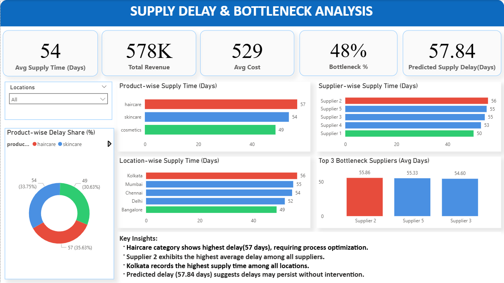

# 📊 Supply Chain Delay & Bottleneck Analysis

## 📌 Problem Statement

Supply chain delays impact operational efficiency, cost, and customer satisfaction.
This project aims to identify bottlenecks across products, suppliers, and locations using data analysis and visualization.

---

## 🎯 Objectives

* Identify high-delay products, suppliers, and locations
* Analyze supply time patterns
* Detect top bottlenecks affecting performance
* Support decision-making using data insights

---

## 🛠️ Tools & Technologies
- Power BI (Dashboard & Visualization)  
- SQL (Data Analysis & Business Queries)  
- Python (Data Cleaning & Preprocessing)  
- DAX (Calculated measures & estimations)
---

## 🐍 Data Preprocessing (Python)
- Cleaned and prepared dataset using Python  
- Handled missing values and formatting  
- Ensured data consistency before analysis  
## 🗂️ Dataset

The dataset includes:

* Product Type
* Supplier Name
* Location
* Supply Time (Days)
* Cost
* Revenue

---

## 📊 Dashboard Features

* KPI Cards (Avg Supply Time, Revenue, Cost, Bottleneck %)
* Product-wise Supply Time Analysis
* Supplier-wise Performance Analysis
* Location-wise Delay Analysis
* Top 3 Bottleneck Suppliers
* Delay Distribution (Donut Chart)
* Insight Panel for business understanding
* Estimated Supply Delay (trend-based)

---

## 🧠 Business Questions (Solved using SQL)

### 1. Which product has the highest average supply time?

```sql
SELECT product_type, AVG(total_supply_time) AS avg_time
FROM supply_chain
GROUP BY product_type
ORDER BY avg_time DESC;
```

---

### 2. Which supplier contributes most to delays?

```sql
SELECT supplier_name, AVG(total_supply_time) AS avg_delay
FROM supply_chain
GROUP BY supplier_name
ORDER BY avg_delay DESC;
```

---

### 3. Which location has the highest delay?

```sql
SELECT location, AVG(total_supply_time) AS avg_delay
FROM supply_chain
GROUP BY location
ORDER BY avg_delay DESC;
```

---

### 4. Top 3 bottleneck suppliers

```sql
SELECT supplier_name, AVG(total_supply_time) AS avg_delay
FROM supply_chain
GROUP BY supplier_name
ORDER BY avg_delay DESC
LIMIT 3;
```

---

### 5. Product-wise delay comparison

```sql
SELECT product_type, AVG(total_supply_time) AS avg_delay
FROM supply_chain
GROUP BY product_type;
```

---

## 📈 Key Insights

* Haircare category shows the highest delay (~57 days)
* Supplier 2 is the major bottleneck
* Kolkata has the maximum supply delay
* Delays are consistent and require process optimization

---

## 📷 Dashboard Preview



---

## 🧠 Approach

* Data cleaning and preprocessing
* SQL queries for business problem solving
* Data modeling in Power BI
* Visualization and dashboard design
* Insight extraction

---

## 🔮 Estimation Approach
A simple trend-based estimation was used to approximate future supply delay based on current average values.

## 🚀 Future Improvements

* Add time-series analysis (monthly trends)
* Implement machine learning forecasting
* Integrate real-time supply chain data

---

## 📌 Conclusion

This project helps identify critical bottlenecks in the supply chain and enables data-driven decisions to improve efficiency and reduce delays.

